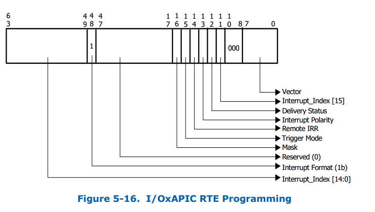
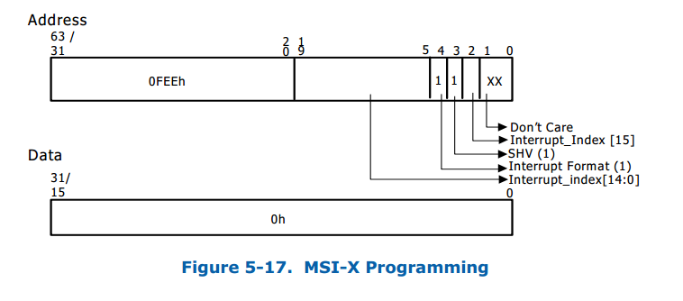

Title: VT-d Interrupt Remapping
Date: 2017-9-22 23:00
Modified: 2017-9-22 23:00
Tags: virtualization
Slug: interrupt-remapping
Authors: Yori Fang
Summary: VT-d Interrupt Remapping

Intel VT-d 虚拟化方案主要目的是解决IO虚拟化中的安全和性能这两个问题，这其中最为核心的技术就是DMA Remapping和Interrupt Remapping。
DMA Remapping通过IOMMU页表方式将直通设备对内存的访问限制到特定的domain中，在提高IO性能的同时完成了直通设备的隔离，保证了直通设备DMA的安全性。Interrupt Remapping则提供IO设备的中断重映射和路由功能，来达到中断隔离和中断迁移的目的，提升了虚拟化环境下直通设备的中断处理效率。

思考一下为什么要搞中断重映射这么一套东西呢？**直通设备的中断不能直通到虚拟机内部吗？**

我们知道直通场景下直通设备的MSI/MSI-X Msg信息都是由Guest直接分配的，那么问题来了设备发送中断的时候写的Msg地址是GPA，肯定不能直接往host上投递，否则就乱套了。在虚拟化场景下，直通设备的中断是无法直接投递到Guest中的，那么我们该怎么办？**我们可以由IOMMU截获中断，先将其中断映射到host的某个中断上，然后再重定向（由VMM投递）到Guest内部。明白这一点，很重要！**

下面对VT-d Interrupt Remapping机制进行一点分析，主要参考资料是[Intel VT-d SPEC Chapter 5](https://www.intel.com/content/www/us/en/embedded/technology/virtualization/vt-directed-io-spec.html)。

### 1 Interrupt Remapping 简介

Interrupt Remapping的出现改变了x86体系结构上的中断投递方式，外部中断源发出的中断请求格式发生了较大的改变，
中断请求会先被中断重映射硬件（IOMMU）截获后再通过查询中断重映射表的方式最终投递到目标CPU上。
这些外部设备中断源则包括了中断控制器(I/OxAPICs)以及MSI/MSIX兼容设备PCI/PCIe设备等。
Interrupt Remapping是需要硬件来支持的，这里的硬件应该主要是指的IOMMU（尽管intel手册并没有直接说明），Interrupt Remapping的Capability是通过Extended Capability Register BIT 3来报告的，如果该位为1表示支持中断重映射。


在没有使能Interrupt Remapping的情况下，设备中断请求格式称之为*Compatibility format*，主要包含一个32bit的Address和一个32bit的Data字段，Address字段包含了中断要投递的目标CPU的APIC ID信息，Data字段主要包含了要投递的vecotr号和投递方式。结构如下图：


其中Address的bit 4为Interrupt Format位，用来标志这个Request是Compatibility format（bit4=0）还是Remapping format (bit4=1)。

在开启了Interrupt Remapping之后，设备的中断请求格式称之为*Remapping format*，其同样由一个32bit的Address和一个32bit的Data字段构成。但与Compatibility format不同的是此时Adress字段不再包含目标CPU的APIC ID信息而是仅包含了一个16bit的HANDLE索引，并且Address的bit4为"1"表示Request为Remapping format。同时bit3是一个标识位(SHV)，用来标志Request是否包含了SubHandle，当该位置位时表示Data字段的低16bit为SubHandle索引。Remapping format的中断请求格式如下图：


在Interrupt Remapping模式下，外设发起中断请求被IOMMU截获，然后硬件自动查询OS在内存中预设的中断重映射表(Interrupt Remapping Table)根据表里的描述来投递中断。中断重映射表由中断重映射表项(Interrupt Remapping Table Entry)构成，每个`IRTE`占用16字节（具体格式介绍见文末），中断重映射表的基地址存放在Interrupt Remapping Table Address Register中。


硬件通过下面的方式去计算中断的`interrupt_index`：
```
    if (address.SHV == 0) {
        interrupt_index = address.handle;
    } else {
        interrupt_index = (address.handle + data.subhandle);
    }
```
备注：引入subhandle的目的是为了兼容MSI中断场景支持对“单个address多个data”的中断投递方式。

中断重映射硬件通过`interrupt_index`去重映射表中索引对应的IRTE，中断重映射硬件可以缓存那些经常使用的IRTE以提升性能。(注:由于handle为16bit，故每个IRT包含65536个IRTE，占用1MB内存空间)

### 2 外设的中断投递方式和中断处理

针对不同的中断源，需要采用不同的方式来投递Remapping格式的中断。

对I/OxAPIC而言，其Remapping格式中断投递格式如下图，软件需要按图中的格式来发起Remapping中断请求，这就要求需要修改“中断重定向表项”(Interrupt Redirection Table Entry)，**注意**不要将ioapic中断重定向和vtd中断重映射搞混淆，这是两个不同的概念，读者可以参考[wiki](http://wiki.osdev.org/IOAPIC)对比下RTE相比于Compatibility格式有哪些不同。值得注意的是bit48这里需要设置为"1"用来标志此RTE为Remapping format，并且RTE的bit10:8固定为000b(即没有SubHandle)。而且vector字段必须和IRTE的vector字段相同！



对于MSI和MSI-X而言，其Remapping格式中断投递格式如下图，值得注意的是在Remapping格式下MSI中断支持multiple vector（大于32个中断向量），但软件必须连续分配N个连续的IRTE并且`interrupt_index`对应HANDLE号必须为N个连续的IRTE的首个。同样bit 4必须为"1"用来表示中断请求为Remapping格式。Data位全部设置为"0"!



中断重映射的硬件处理步骤如下：

* IOMMU识别到物理地址0xFEEx_xxxx范围内的DWORD写请时，将该请求认定为中断请求；
* 当Interrupt Remapping没有使能时，所有的中断都按照Compatibility format来处理；
* 当Intgrrupt Remapping被使能时，中断请求处理流程如下：

    1. 如果来的中断请求为Compatibility format：

        先检测**IRTA**(Interrupt Remapping Table Address Register)寄存器的EIME位，如果该位为“1”那么Compatibility format的中断被blocked，否则Compatibility format中断请求都按照pass-through方式处理（传统方式）。

    2. 如果来的中断请求为Remapping format：

        先检测reserved fileds是否为0，如果检查失败那么中断请求被blocked。接着硬件按照上面提到的算法计算出`interrupt_index`并检测其是否合法，如果该`interrupt_index`合法那么根据`interrupt_index`索引中断重映射表找到对应的IRTE，然后检测IRTE中的Present位，如果Preset位为0那么中断请求被blocked，如果Present位为1，硬件校验IRTE其他field合法后按照IRTE的约定产生一条中断请求。

中断重映射的软件处理步骤如下：

*   分配一个IRTE并且按照IRTE的格式要求填好IRTE的每个属性；
*   按照Remapping format的要求对中断源进行编程，在合适的时候触发一个Remapping format格式的中断请求。


### 附：Remapping格式中断重映射表项的格式

Interrupt Remapping格式的中断重映射表项的格式为（下篇会介绍Interrupt Posting格式的中断重映射表项）:


其中比较关键的中断描述信息为：

*   Present域(P)：0b表示此IRTE还没有被分配到任何的中断源，索引到此IRTE的Remapping中断将被blocked掉，1b表示此IRTE是有效的，已经被分配到某个设备。
*   Destination Mode域(DM)：0b表示Destination ID域为Physical APIC-ID，1b表示Destination ID域是Logical APIC-ID。
*   IRTE Mode域(IM)：0b表示此中断请求是一个Remapped Interrupt中断请求，1b表示此中断请求是一个Posted Interrupt中断请求。
*   Vector域(V)：共8个Byte表示了此Remapped Interrupt中断请求的vector号(Remapped Interrupt)。
*   Destination ID域(DST)：表示此中断请求的目标CPU，根据当前Host中断方式不同具有不同的格式。xAPIC Mode (Cluster)为bit[40:47]， xAPIC Mode (Flat)和xAPIC Mode (Physical)为bit[47:40]， x2APIC Mode (Cluster)和x2APIC Mode (Physical)为bit[31:0]。
*   SID, SQ, SVT则联合起来表示了中断请求的设备PCI/PCI-e request-id信息。
