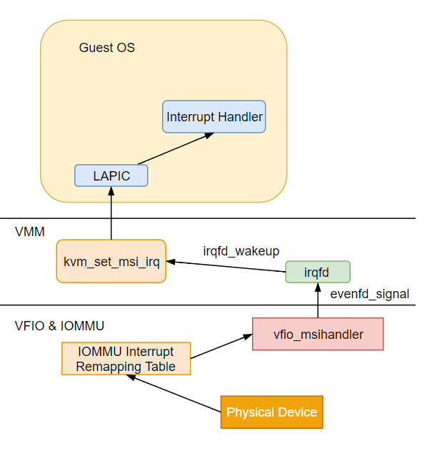

Title:  VT-d Interrupt Remapping Code Analysis
Date: 2019-1-24 22:00
Modified: 2019-8-24 23:00
Tags: virtualization
Slug: vtd_interrupt_remapping_code_analysis
Status: published
Authors: Yori Fang
Summary: vtd interrupt remapping

## VT-d 中断重映射分析

本文中我们将一起来分析一下VT-d中断重映射的代码实现，
在看本文前建议先复习一下VT-d中断重映射的原理，可以参考[VT-D Interrupt Remapping](https://kernelgo.org/interrupt-remapping.html)这篇文章。
看完中断重映射的原理我们必须明白：直通设备的中断是无法直接投递到Guest中的，需要先将其中断映射到host的某个中断上，然后再重定向（由VMM投递）到Guest内部．

我们将从

* 1.中断重映射Enable
* 2.中断重映射实现
* 3.中断重映射下中断处理流程

这3个层面去分析VT-d中断重映射的代码实现。

## 1.中断重映射Enable

当BIOS开启VT-d特性之后，操作系统初始化的时候会通过cpuid去检测硬件平台是否支持VT-d Interrupt Remapping能力，
然后做一些初始化工作后将操作系统的中断处理方式更改为Interrupt Remapping模式。

```c
start_kernel
    --> late_time_init --> x86_late_time_init
        --> x86_init.irqs.intr_mode_init()
            --> apic_intr_mode_init
                --> default_setup_apic_routing
                    --> enable_IR_x2apic
                        --> irq_remapping_prepare   # Step1:使能Interrupt Reampping
                            --> intel_irq_remap_ops.prepare() 
                                --> remap_ops = &intel_irq_remap_ops
                        --> irq_remapping_enable    # Step2:做一些工作
                            --> remap_ops->enable()
```
从代码堆栈可以看到内核初始化的时候会初始化中断，在default_setup_apic_routing中会分2个阶段对Interrupt Remapping进行Enable。
这里涉及到一个关键的数据结构intel_irq_remap_ops，它是Intel提供的Intel CPU平台的中断重映射驱动方法集。

```c
struct irq_remap_ops intel_irq_remap_ops = {
        .prepare                = intel_prepare_irq_remapping,
        .enable                 = intel_enable_irq_remapping,
        .disable                = disable_irq_remapping,
        .reenable               = reenable_irq_remapping,
        .enable_faulting        = enable_drhd_fault_handling,
        .get_ir_irq_domain      = intel_get_ir_irq_domain,
        .get_irq_domain         = intel_get_irq_domain,
}; 
```

阶段1调用intel_irq_remap_ops的prepare方法。该方法主要做的事情有：

* 调用了dmar_table_init从ACPI表中解析了DMAR Table关键信息。
关于VT-d相关的ACPI Table信息可以参考[VT-D Spec Chapter 8 BIOS Consideration](xxx)和[Introduction to Intel IOMMU](https://kernelgo.org/intel_iommu.html)
这篇文章。
* 遍历每个iommu检查是否支持中断重映射功能（dmar_ir_support）。
* 调用intel_setup_irq_remapping为每个IOMMU分配中断重映射表（Interrupt Remapping Table）。

```c
static int intel_setup_irq_remapping(struct intel_iommu *iommu)
{
    ir_table = kzalloc(sizeof(struct ir_table), GFP_KERNEL);
    //为IOMMU申请一块内存，存放ir_table和对应的bitmap
    pages = alloc_pages_node(iommu->node, GFP_KERNEL | __GFP_ZERO,
				 INTR_REMAP_PAGE_ORDER);
    bitmap = kcalloc(BITS_TO_LONGS(INTR_REMAP_TABLE_ENTRIES),
			 sizeof(long), GFP_ATOMIC);
    // 创建ir_domain和ir_msi_domain
    iommu->ir_domain =
		irq_domain_create_hierarchy(arch_get_ir_parent_domain(),
					    0, INTR_REMAP_TABLE_ENTRIES,
					    fn, &intel_ir_domain_ops,
					    iommu);
    irq_domain_free_fwnode(fn);
    iommu->ir_msi_domain =
		arch_create_remap_msi_irq_domain(iommu->ir_domain,
						 "INTEL-IR-MSI",
						 iommu->seq_id);
    ir_table->base = page_address(pages);
    ir_table->bitmap = bitmap;
    iommu->ir_table = ir_table;
    iommu_set_irq_remapping  //最后将ir_table地址写入到寄存器中并最后enable中断重映射能力
}
```
阶段2调用irq_remapping_enable中判断Interrupt Remapping是否Enable如果还没有就Enable一下，然后set_irq_posting_cap设置Posted Interrupt Capability等。

## 2.中断重映射实现

要使得直通设备的中断能够工作在Interrupt Remapping模式下VFIO中需要做很多的准备工作．
首先，QEMU会通过PCI配置空间向操作系统呈现直通设备的MSI/MSI-X Capability，
这样Guest OS加载设备驱动程序时候会尝试去Enable直通设备的MSI/MSI-X中断．
为了方便分析代码流程这里以MSI中断为例。
Guest OS设备驱动尝试写配置空间来Enable设备中断，这时候会访问设备PCI配置空间发生VM Exit被QEMU截获处理．
对于MSI中断Enable会调用`vfio_msi_enable`函数．

从PCI Local Bus Spec 可以知道MSI中断的PCI Capability为[xxx](引用)

```c
QEMU Code:
static void vfio_msi_enable(VFIOPCIDevice *vdev)
{
    int ret, i;

    vfio_disable_interrupts(vdev);  #先disable设备中断

    vdev->nr_vectors = msi_nr_vectors_allocated(&vdev->pdev);	 #从设备配置空间读取设备Enable的MSI中断数目
    vdev->msi_vectors = g_new0(VFIOMSIVector, vdev->nr_vectors); 

    for (i = 0; i < vdev->nr_vectors; i++) {
        VFIOMSIVector *vector = &vdev->msi_vectors[i];

        vector->vdev = vdev;
        vector->virq = -1;
        vector->use = true;
	
        if (event_notifier_init(&vector->interrupt, 0)) {
            error_report("vfio: Error: event_notifier_init failed");
        }
        qemu_set_fd_handler(event_notifier_get_fd(&vector->interrupt),　// 绑定irqfd的处理函数
                            vfio_msi_interrupt, NULL, vector);
        // 将中断信息刷新到kvm irq routing table里，其实就是建立起gsi和irqfd的映射关系
        vfio_add_kvm_msi_virq(vdev, vector, i, false);　
    }
    /* Set interrupt type prior to possible interrupts */
    vdev->interrupt = VFIO_INT_MSI;
    
    // 使能msi中断！！！重点分析
    ret = vfio_enable_vectors(vdev, false);
 　 ....
}
```
`vfio_msi_enable`的主要流程是：从配置空间查询支持的中断数目 --> 对每个MSI中断进行初始化（分配一个irqfd） --> 将MSI gsi信息和irqfd绑定并刷新到中断路由表中 --> 使能中断（调用vfio-pci内核ioctl为MSI中断申请irte并刷新中断路由表表项）。
```c
QEMU Code:
vfio_pci_write_config
    --> vfio_msi_enable
        --> vfio_add_kvm_msi_virq
            --> kvm_irqchip_add_msi_route   #为MSI中断申请gsi，并更新irq routing table（QEMU里面有一份Copy）
                --> kvm_irqchip_commit_routes
            --> kvm_irqchip_add_irqfd_notifier_gsi #将irqfd和gsi映射信息注册到kvm内核模块中fd = kvm_interrupt, gsi=virq, flags=0, rfd=NULL
                --> kvm_vm_ioctl(s, KVM_IRQFD, &irqfd) 
        --> vfio_enable_vectors
            --> ioctl(vdev->vbasedev.fd, VFIO_DEVICE_SET_IRQS, irq_set) #调用vfio-pci内核接口使能中断，重点分析！
```
kvm_irqchip_commit_routes的逻辑比较简单这里跳过，kvm_irqchip_add_irqfd_notifier_gsi的逻辑稍微有些复杂后面专门写一篇来分析，
只需要知道这里是将gsi和irqfd信息注册到内核模块中（KVM irqfd提供了一种中断注入机制）并且可以在这个fd上监听事件来达到中断注入的目的。
这里重点分析`vfio_enable_vectors`的代码流程。

```c
Kernel Code:
vfio_enable_vectors
    --> vfio_pci_ioctl  // irq_set 传入了一个irqfd数组
        --> vfio_pci_set_irqs_ioctl
            --> vfio_pci_set_msi_trigger
                --> vfio_msi_enable    #Step1：为MSI中断申请Host IRQ，这里会一直调用到Interrupt Remapping框架分配IRTE
                    --> pci_alloc_irq_vectors
                --> vfio_msi_set_block #Step2：这里绑定irqfd，建立好中断注入通道
                    --> vfio_msi_set_vector_signal
```
`vfio_pci_set_msi_trigger`函数中主要有2个关键步骤。

### vfio_msi_enable

vfio_msi_enable -> pci_alloc_irq_vectors -> pci_alloc_irq_vectors_affinity -> __pci_enable_msi_range -> msi_capability_init -> pci_msi_setup_msi_irqs -> arch_setup_msi_irqs -> x86_msi.setup_msi_irqs -> native_setup_msi_irqs -> msi_domain_alloc_irqs -> __irq_domain_alloc_irqs,irq_domain_activate_irq

这里内核调用栈比较深，我们只需要知道`vfio_msi_enable`最终调用到了`__irq_domain_alloc_irqs` -> `intel_irq_remapping_alloc`.
在`intel_irq_remapping_alloc`中申请这个中断对应的IRTE。这里先调用的`alloc_irte`函数返回irte在中断重映射表中的index号（即中断重映射表的索引号），
再调用`intel_irq_remapping_prepare_irte`去填充irte。

```c
static int intel_irq_remapping_alloc(struct irq_domain *domain,
                                     unsigned int virq, unsigned int nr_irqs,
                                     void *arg)
{
	index = alloc_irte(iommu, virq, &data->irq_2_iommu, nr_irqs); #向Interrupt Remapping Table申请index
	for (i = 0; i < nr_irqs; i++) {
	        irq_data = irq_domain_get_irq_data(domain, virq + i);
                irq_cfg = irqd_cfg(irq_data);
                irq_data->hwirq = (index << 16) + i;
                irq_data->chip_data = ird;
                irq_data->chip = &intel_ir_chip;
                intel_irq_remapping_prepare_irte(ird, irq_cfg, info, index, i);
	}
}
```
`irq_domain_activate_irq`最终会调用到：intel_irq_remapping_activate -> intel_ir_reconfigure_irte -> modify_irte 。
`modify_irte`中会将新的irte刷新到中断重定向表中。

### vfio_msi_set_block

`vfio_msi_set_block`中调用`vfio_msi_set_vector_signal`为每个msi中断安排其Host IRQ的信号处理钩子，用来完成中断注入。
其内核调用栈为：
```
vfio_pci_ioctl 
vfio_pci_set_irqs_ioctl
vfio_pci_set_msi_trigger
vfio_msi_set_block
irq_bypass_register_producer
__connect
kvm_arch_irq_bypass_add_producer
vmx_update_pi_irte    #在Posted Interrupt模式下在这里刷新irte为Posted Interrupt 模式
irq_set_vcpu_affinity
intel_ir_set_vcpu_affinity
modify_irte
```

再看下一`vfio_msi_set_vector_signal`的代码主要流程。
可以看出vfio_msi_set_vector_signal中为设备MSI中断申请了一个ISR，即vfio_msihandler，
然后注册了一个producer。
```c
static int vfio_msi_set_vector_signal(struct vfio_pci_device *vdev,
				      int vector, int fd, bool msix)
{
	irq = pci_irq_vector(pdev, vector); #获得每个MSI中断的irq号，
    
	trigger = eventfd_ctx_fdget(fd);
	if (msix) {
		struct msi_msg msg;

		get_cached_msi_msg(irq, &msg);
		pci_write_msi_msg(irq, &msg);
	}
	#在host上申请中断处理函数
	ret = request_irq(irq, vfio_msihandler, 0,
			  vdev->ctx[vector].name, trigger);

	vdev->ctx[vector].producer.token = trigger;  # irqfd对应的event_ctx
	vdev->ctx[vector].producer.irq = irq;
	ret = irq_bypass_register_producer(&vdev->ctx[vector].producer);

	vdev->ctx[vector].trigger = trigger;
}
```
这样直通设备的中断会触发Host上的vfio_msihandler这个中断处理函数。在这个函数中向这个irqfd发送了一个信号通知中断到来，
如此一来KVM irqfd机制在poll这个irqfd的时候会受到这个事件，随后调用事件的处理函数注入中断。
irqfd_wakeup -> EPOLLIN -> schedule_work(&irqfd->inject) -> irqfd_inject -> kvm_set_irq这样就把中断注入到虚拟机了。
```
static irqreturn_t vfio_msihandler(int irq, void *arg)
{
	struct eventfd_ctx *trigger = arg;

	eventfd_signal(trigger, 1);
	return IRQ_HANDLED;
}
```
思考一下：为什么触发这个irqfd的写事件后，直通设备的中断就能够被**重映射**到虚拟机内部呢？

原因在于，前面我们提到的直通设备MSI中断的GSI和irqfd是一对一绑定的，
所以直通设备在向Guest vCPU投递MSI中断的时候首先会被IOMMU截获，
中断被重定向到Host IRQ上，然后通过irqfd注入MSI中断到虚拟机内部。


## 3.中断重映射下中断处理流程

为了方便理解，我花了点时间画了下面这张图，方便读者理解中断重映射场景下直通设备的中断处理流程：



总结一下中断重映射Enable和处理流程：
```
QEMU向虚拟机呈现设备的PCI配置空间信息 
	-> 设备驱动加载，读写PCI配置空间Enable MSI
	-> VM Exit到QEMU中处理vfio_pci_write_config
	-> QEMU调用vfio_msi_enable使能直通设备MSI中断
        vfio_msix_vector_do_use分配一个MSI中断
            ->vfio_add_kvm_msi_virq
	        kvm_irqchip_add_msi_route -> kvm_set_irq_routing新建一个MSI中断路由表项，
            kvm_irqchip_add_irqfd_notifier_gsi -> kvm_irqchip_assign_irqfd注册irqfd和gsi的映射关系
        vfio_enable_vectors设置VFIO的MSI中断触发方式，VFIO_DEVICE_SET_IRQS
            vfio_pci_set_irqs_ioctl 内核drivers/vfio/pci/vfio_pci.c
		    vfio_pci_set_msi_trigger分配Host irq并分配对应的IRTE和刷新中断重映射表，
		    vfio_msi_set_vector_signal注册Host irq的中断处理函数vfio_msihandler 
        irq_bypass_register_producer 将fd注册到kvm
    -> vfio_msihandler写了irqfd这样就触发了EPOLLIN事件 
	-> irqfd接受到EPOLLIN事件，调用irqfd_wakeup
	-> kvm_arch_set_irq_inatomic 尝试直接注入中断，如果被BLOCK了（vCPU没有退出？）就调用 schedule_work(&irqfd->inject)，让kworker延后处理
	-> irqfd_inject向虚拟机注入中断 
	-> 虚拟机退出的时候写对应VCPU的vAPIC Page IRR字段注入中断到Guest内部。
```
Done!
