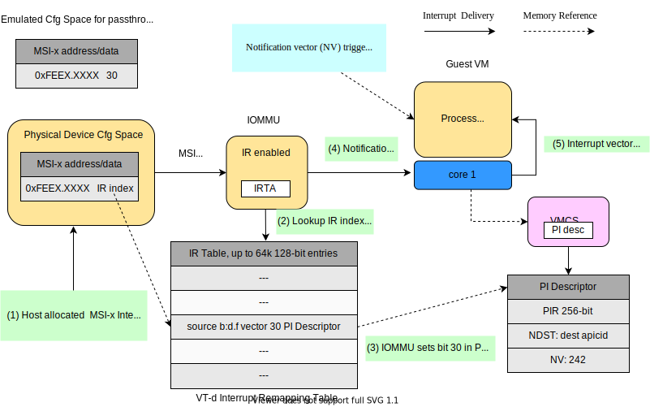

Title:  VT-d Interrupt Posting Code Analysis
Date: 2019-1-25 23:00
Modified: 2019-1-25 23:00
Tags: virtualization
Slug: vtd-posted-interrupt-code-analysis
Status: published
Authors: Yori Fang
Summary: vtd interrupt posting

## VT-d Posted Interrupt 代码分析

Posted Interrupt是基于Interrupt Remapping机制实现的，关于VT-d Posted Interrupt的原理可以参考[VT-d Posted Interrupt](https://kernelgo.org/posted-interrupt.html)，建议先了解原理再来看代码分析。

分析VT-d Posted Interrupt代码的代码需要从vCPU调度入手，为了实现中断的直接投递和中断迁移，
在vCPU调度时候VMM需要为Posted Interrupt做一些额外的工作，但这些额外的工作带来的中断实时性提升是可观的。

## per-vCPU Posted Interrupt Descriptor

为了支持VT-d Posted Interrup Inter为vCPU引入了Posted Interrupt Descriptor数据结构，其中有pir，on,sn,nv,ndst等几个关键域。

* PIR：记录了要给虚拟机vCPU投递的vector号（由硬件自动写入并由VMM软件读取）；
* ON：当中断到来时ON标志位自动置位告知guest我有中断要投递给你了；
* SN：是VMM软件用来告知VT-d硬件当前vCPU不在Running状态你不要给我投中断了我收不到；
* NV：是主机上配合Poste Interrupt工作的一个中断vector（它的值只能是wakeup_vector或者notification vector）；
* NDST：存放当前vCPU所在PCPU的apicid（由VMM负责刷新，确保中断可以自动迁移到目的pCPU上）。

```c
/* Posted-Interrupt Descriptor */
struct pi_desc {
	u32 pir[8];     /* Posted interrupt requested */
	union {
		struct {
				/* bit 256 - Outstanding Notification */
			u16	on	: 1,
				/* bit 257 - Suppress Notification */
				sn	: 1,
				/* bit 271:258 - Reserved */
				rsvd_1	: 14;
				/* bit 279:272 - Notification Vector */
			u8	nv;
				/* bit 287:280 - Reserved */
			u8	rsvd_2;
				/* bit 319:288 - Notification Destination */
			u32	ndst;
		};
		u64 control;
	};
	u32 rsvd[6];
} __aligned(64);
```
首先要明确`pi_desc`是per-vcpu的，所以在每个vCPU的数据结构struct `vcpu_vmx`里面会包含一个`pi_desc`数据结构。
```c
struct vcpu_vmx {
	/* Posted interrupt descriptor */
	struct pi_desc pi_desc;
}
```
vCPU创建的时候会将NV置成POSTED_INTR_VECTOR也就是notification event的中断号，同时把SN置1（因为这时候vCPU还没有运行）。
`kvm_vm_ioctl_create_vcpu` => `kvm_arch_vcpu_create` => `vmx_vcpu_create`，这里会注册vCPU的preempt notifier，
当调度器选中vCPU线程的时候VMM会收到通知，VMM调用回调函数进行处理。

```c
static struct kvm_vcpu *vmx_create_vcpu(struct kvm *kvm, unsigned int id)
{
	preempt_notifier_init(&vcpu->preempt_notifier, &kvm_preempt_ops); #注册vcpu的preempt notifier
	/*
	 * Enforce invariant: pi_desc.nv is always either POSTED_INTR_VECTOR
	 * or POSTED_INTR_WAKEUP_VECTOR.
	 */
	vmx->pi_desc.nv = POSTED_INTR_VECTOR;
	vmx->pi_desc.sn = 1;
}
```
同时`kvm_vm_ioctl_create_vcpu` => `kvm_arch_vcpu_setup` => `vcpu_load`, `vcpu_put`会对pi_desc做一些修改，
后面结合虚拟机vCPU调度进行代码分析。

## vCPU调度与VT-d Posted Interrupt

vCPU的运行状态主要有3种：

* Running 状态：vCPU正处于非根模式下运行
* Runnable 状态：vCPU线程被抢占或者时间片到期，等待OS的下一次调度
* Blocked 状态： vCPU执行hlt指令后从非根模式block出来准备休眠的状态

vCPU调度就是指在VMM的管理下虚拟机的vCPU线程在这几种状态之间切换的场景，
针对不同的状态转变VMM会干预进来为Posted Interrupt做一些额外的工作以确保中断自动迁移可以顺利进行。


### vCPU 从 Runnable => Running

当vCPU被调度器选中运行之前会调用VMM的回调函数，在kvm中这个函数时`kvm_sched_in`。
```c
static void kvm_sched_in(struct preempt_notifier *pn, int cpu)
{
	struct kvm_vcpu *vcpu = preempt_notifier_to_vcpu(pn);

	if (vcpu->preempted)
		vcpu->preempted = false;  #将vcpu被抢占的标志位清零

	kvm_arch_sched_in(vcpu, cpu); #调整一下ple window
	#将VMCS加载到pCPU上准备运行了（这里可能是调度到其他pCPU上运行，也可能是继续在原来pCPU上运行）
	kvm_arch_vcpu_load(vcpu, cpu); 
}
```
`kvm_sched_in` => `kvm_arch_vcpu_load` => `vmx_vcpu_load` => `vmx_vcpu_pi_load`，
vCPU要从Runnable状态切换到Running状态了，
这时候要:刷新NDST为vCPU要运行到的pCPU的apic id，并设置SN=0（告知硬件我现在可以接收Posted Interrupt了）。

```c
static void vmx_vcpu_pi_load(struct kvm_vcpu *vcpu, int cpu)
{
	struct pi_desc *pi_desc = vcpu_to_pi_desc(vcpu);
	struct pi_desc old, new;
	unsigned int dest;

	/*
	 * In case of hot-plug or hot-unplug, we may have to undo
	 * vmx_vcpu_pi_put even if there is no assigned device.  And we
	 * always keep PI.NDST up to date for simplicity: it makes the
	 * code easier, and CPU migration is not a fast path.
	 */
	if (!pi_test_sn(pi_desc) && vcpu->cpu == cpu)
		return;

	/*
	 * First handle the simple case where no cmpxchg is necessary; just
	 * allow posting non-urgent interrupts.
	 *
	 * If the 'nv' field is POSTED_INTR_WAKEUP_VECTOR, do not change
	 * PI.NDST: pi_post_block will do it for us and the wakeup_handler
	 * expects the VCPU to be on the blocked_vcpu_list that matches
	 * PI.NDST.
	 */
	if (pi_desc->nv == POSTED_INTR_WAKEUP_VECTOR ||
	    vcpu->cpu == cpu) {
		pi_clear_sn(pi_desc);
		return;
	}

	/* The full case.  */
	do {
		old.control = new.control = pi_desc->control;

		dest = cpu_physical_id(cpu);

		if (x2apic_enabled())
			new.ndst = dest;
		else
			new.ndst = (dest << 8) & 0xFF00;

		new.sn = 0;
	} while (cmpxchg64(&pi_desc->control, old.control,
			   new.control) != old.control);
}
```
### vCPU 从 Running => Runnable

当vCPU被抢占或者时间片到期的时候vCPU被调度出来，这时候会触发回调函数`kvm_sched_out`。
```c
static void kvm_sched_out(struct preempt_notifier *pn,
			  struct task_struct *next)
{
	struct kvm_vcpu *vcpu = preempt_notifier_to_vcpu(pn);

	if (current->state == TASK_RUNNING)
		vcpu->preempted = true;     #置上vcpu被抢占标志位
	
	#将vCPU的VMCS从当前pCPU上拿下来，并且保存一下vCPU的相关信息到VMCS中
	kvm_arch_vcpu_put(vcpu);	    
}
```

`kvm_sched_out` => `vmx_vcpu_put` => `vmx_vcpu_pi_put`，这里vCPU要被调度出来的，
那么要把SN bit置位（中断抑制），告诉硬件我不在运行了，先别给我投递中断，我暂时无法处理。

```c
static void vmx_vcpu_pi_put(struct kvm_vcpu *vcpu)
{
	struct pi_desc *pi_desc = vcpu_to_pi_desc(vcpu);

	if (!kvm_arch_has_assigned_device(vcpu->kvm) ||
		!irq_remapping_cap(IRQ_POSTING_CAP)  ||
		!kvm_vcpu_apicv_active(vcpu))
		return;

	/* Set SN when the vCPU is preempted */
	if (vcpu->preempted)
		pi_set_sn(pi_desc);  # set SN bit here
}
```

### vCPU 从 Running => Blocked

当vCPU在Running状态下非根模式执行hlt指令后会被VMM截获发生VM Exit（肯定不能让vCPU在非根模式下中止，这样会浪费CPU资源），
这时候会调用`vcpu_block`函数来处理。

```c
static inline int vcpu_block(struct kvm *kvm, struct kvm_vcpu *vcpu)
{
	if (!kvm_arch_vcpu_runnable(vcpu) &&
	    (!kvm_x86_ops->pre_block || kvm_x86_ops->pre_block(vcpu) == 0)) {
		srcu_read_unlock(&kvm->srcu, vcpu->srcu_idx);
		kvm_vcpu_block(vcpu);
		vcpu->srcu_idx = srcu_read_lock(&kvm->srcu);

		if (kvm_x86_ops->post_block)
			kvm_x86_ops->post_block(vcpu);

		if (!kvm_check_request(KVM_REQ_UNHALT, vcpu))
			return 1;
	}

	kvm_apic_accept_events(vcpu);
	switch(vcpu->arch.mp_state) {
	case KVM_MP_STATE_HALTED:
		vcpu->arch.pv.pv_unhalted = false;
		vcpu->arch.mp_state =
			KVM_MP_STATE_RUNNABLE;
	case KVM_MP_STATE_RUNNABLE:
		vcpu->arch.apf.halted = false;
		break;
	case KVM_MP_STATE_INIT_RECEIVED:
		break;
	default:
		return -EINTR;
		break;
	}
	return 1;
}
```
vcpu_block细分为3个阶段Pre Block, Block 和 Post Block。Pre Block阶段会调用`pi_pre_block`，
这里会将vCPU添加到一个per pCPU的等待链表（waiting list）上，
这个链表记录了所有在这个pCPU上休眠的vCPU列表，然后更新NDST域。

```c
static int pi_pre_block(struct kvm_vcpu *vcpu)
{
	unsigned int dest;
	struct pi_desc old, new;
	struct pi_desc *pi_desc = vcpu_to_pi_desc(vcpu);
	# 虚拟机没有配置直通设备 || 不支持Posted Interrupt => 直接返回
	if (!kvm_arch_has_assigned_device(vcpu->kvm) ||
		!irq_remapping_cap(IRQ_POSTING_CAP)  ||
		!kvm_vcpu_apicv_active(vcpu))
		return 0;
	
	# 关中断， 将当前vCPU线程加入到上次运行的pCPU的等待列表中
	WARN_ON(irqs_disabled());
	local_irq_disable();  
	if (!WARN_ON_ONCE(vcpu->pre_pcpu != -1)) {
		vcpu->pre_pcpu = vcpu->cpu;
		spin_lock(&per_cpu(blocked_vcpu_on_cpu_lock, vcpu->pre_pcpu));
		list_add_tail(&vcpu->blocked_vcpu_list,
			      &per_cpu(blocked_vcpu_on_cpu,
				       vcpu->pre_pcpu));
		spin_unlock(&per_cpu(blocked_vcpu_on_cpu_lock, vcpu->pre_pcpu));
	}
	
	#刷新NDST，更新NV为wakeup vector
	do {
		old.control = new.control = pi_desc->control;

		WARN((pi_desc->sn == 1),
		     "Warning: SN field of posted-interrupts "
		     "is set before blocking\n");

		/*
		 * Since vCPU can be preempted during this process,
		 * vcpu->cpu could be different with pre_pcpu, we
		 * need to set pre_pcpu as the destination of wakeup
		 * notification event, then we can find the right vCPU
		 * to wakeup in wakeup handler if interrupts happen
		 * when the vCPU is in blocked state.
		 */
		dest = cpu_physical_id(vcpu->pre_pcpu);

		if (x2apic_enabled())
			new.ndst = dest;
		else
			new.ndst = (dest << 8) & 0xFF00;

		/* set 'NV' to 'wakeup vector' */
		new.nv = POSTED_INTR_WAKEUP_VECTOR;
	} while (cmpxchg64(&pi_desc->control, old.control,
			   new.control) != old.control);
	
	#如果在pre block阶段收到了中断，那么就不block了，直接转导Runnable状态去
	/* We should not block the vCPU if an interrupt is posted for it.  */
	if (pi_test_on(pi_desc) == 1)
		__pi_post_block(vcpu);

	local_irq_enable();
	return (vcpu->pre_pcpu == -1);
}
```
Pre Block阶段过后会调用`kvm_vcpu_block`，在这个函数中会调用schdule()主动把vCPU调度出去（休眠），让出pCPU执行其他vCPU的代码。

### vCPU 从 Blocked => Runnable

可以从这么一种场景理解：如果vcpu0和vcpu1都在同一个物理CPU上运行，某一时刻vcpu0正在运行，
vcpu1还处于休眠状态，这是外部设备产生了一个中断需要注入到vcpu1上：

* Device会按照初始化配置的MSI-x中断格式给提交一个Interrupt Reqeust，由于提交的是Remapping格式中断会被IOMMU截获。
* IOMMU查询IRTE解析出vcpu1对应点PD和NV（notification vector），但此时vcpu1还在睡觉，因此NV是被设置成wakeup vector的。
* 物理cpu接收到wakeup interrupt，导致正在运行的vcpu0被kick到root模式下，在wakeup interrupt handler中遍历`blocked_vcpu_on_cpu`链表，
得知vcpu1上有个中断需要处理，将vcpu1扔到运行队列中，将vcpu从Block状态变为Runnale状态。

```c
/*                                                                              
 * Handler for POSTED_INTERRUPT_WAKEUP_VECTOR.                                  
 */                                                                             
void pi_wakeup_handler(void)                                                                                                   
{                                                                               
    struct kvm_vcpu *vcpu;
	// 获取当前物理CPU的id                                                      
    int cpu = smp_processor_id();                                               

	// 遍历当前物理CPU的blocked_vcpu_list                                                                      
    spin_lock(&per_cpu(blocked_vcpu_on_cpu_lock, cpu));                         
    list_for_each_entry(vcpu, &per_cpu(blocked_vcpu_on_cpu, cpu),               
            blocked_vcpu_list) {                                                
        struct pi_desc *pi_desc = vcpu_to_pi_desc(vcpu);                        

		// 检测vcpu的PD是否ON被硬件置位                                                                        
        if (pi_test_on(pi_desc) == 1)                                           
            kvm_vcpu_kick(vcpu);  // 唤醒睡眠的vcpu                                         
    }                                                                           
    spin_unlock(&per_cpu(blocked_vcpu_on_cpu_lock, cpu));                       
}         
```

当vCPU休眠结束之后会调用`vmx_post_block` => `__pi_post_block`这时候vCPU结束睡眠被重新调度。
注意这里会更新NDST并将vCPU从pCPU等待链表上删除，并且把NV置位`POSTED_INTR_VECTOR`。

```c
static void __pi_post_block(struct kvm_vcpu *vcpu)
{
	struct pi_desc *pi_desc = vcpu_to_pi_desc(vcpu);
	struct pi_desc old, new;
	unsigned int dest;
	#再度更新NDST，因为block睡眠之后被再调度出来执行的时候可能换了pCPU！
	do {
		old.control = new.control = pi_desc->control;
		WARN(old.nv != POSTED_INTR_WAKEUP_VECTOR,
		     "Wakeup handler not enabled while the VCPU is blocked\n");

		dest = cpu_physical_id(vcpu->cpu);

		if (x2apic_enabled())
			new.ndst = dest;
		else
			new.ndst = (dest << 8) & 0xFF00;

		/* set 'NV' to 'notification vector' */
		new.nv = POSTED_INTR_VECTOR;
	} while (cmpxchg64(&pi_desc->control, old.control,
			   new.control) != old.control);
	#将vCPU从等待列表中删除掉
	if (!WARN_ON_ONCE(vcpu->pre_pcpu == -1)) {
		spin_lock(&per_cpu(blocked_vcpu_on_cpu_lock, vcpu->pre_pcpu));
		list_del(&vcpu->blocked_vcpu_list);
		spin_unlock(&per_cpu(blocked_vcpu_on_cpu_lock, vcpu->pre_pcpu));
		vcpu->pre_pcpu = -1;
	}
}
```
剩下一种状态转换路径 vCPU从 Runable => Blocked状态，这和从Running状态切换成Blocked状态一致，这里不再赘述！

整个VT-d Posted Interrupt 工作原理如下图所示：

